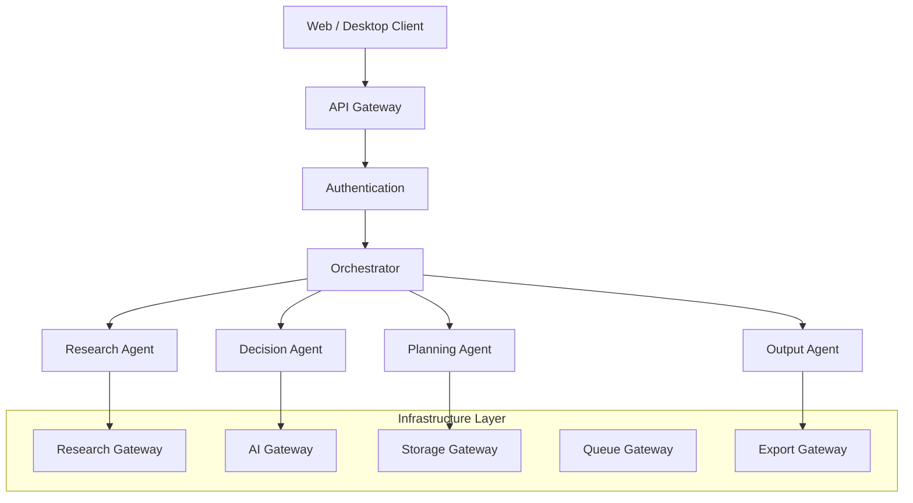
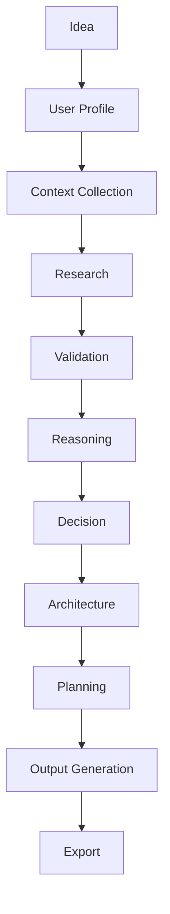

# Genesis Engine

**Version:** 1.0  
**Status:** Active  

---

## 🚀 What is Genesis?

Genesis is an **AI-native Product Intelligence Platform** that transforms uncertain ideas into validated, production-ready execution blueprints.

> Genesis doesn't just ask "How do I build this?"  
> It first asks "**Should this even be built?**"

---

## ❌ What Genesis is NOT

- Not a chatbot
- Not an AI coding assistant  
- Not a PRD generator
- Not another IDE replacement

---

## ✅ What Genesis IS

- An intelligent engineering system
- A product validation platform
- An architecture-driven development tool
- A decision intelligence engine

---

## 🎯 Primary Objectives

Genesis exists to **reduce expensive engineering mistakes** before they happen by improving:

- Engineering quality
- Product quality  
- Decision quality
- Security
- AI execution quality
- Development speed
- Cost efficiency
- Long-term maintainability

---

## 🏗️ Core Architecture



---

## 🔄 Core Workflow

Every project follows this lifecycle:



---

## 📁 Repository Structure

```
genesis/
├── docs/                     # Documentation
│   ├── architecture/         # Core architecture docs
│   ├── contracts/            # Interface definitions
│   ├── governance/adr/       # Decision records
│   ├── visualization/        # Mermaid diagrams
│   └── runbooks/             # Operational procedures
├── src/                      # Source code
│   ├── core/                 # Core business logic
│   ├── infrastructure/       # External integrations
│   ├── domain/               # Business domain
│   ├── application/          # Application services
│   └── presentation/         # API, CLI, UI
├── tests/                    # Test suites
├── config/                   # Configuration
├── scripts/                  # Automation
├── .clinerules              # AI rules (critical)
└── README.md                # This file
```

---

## 🛡️ Key Design Principles

### 1. Reason Before Generation
Generation without reasoning creates technical debt.

### 2. Evidence Before Reasoning
Reasoning must be supported by collected evidence.

### 3. One Responsibility Per Component
Components communicate, not absorb responsibilities.

### 4. Replace Providers, Never Architecture
Providers change. Architecture remains stable.

### 5. LLMs Reason, Software Executes
Clear separation between reasoning and execution.

### 6. Everything Observable
Latency, cost, tokens, failures, cache hits – all measurable.

---

## 🔑 Critical Files

| File | Purpose |
|------|---------|
| `docs/architecture/00_project_rules.md` | Non-negotiable project rules |
| `docs/architecture/00_ai_bootstrap_prompt.md` | AI bootloader for any coding assistant |
| `.clinerules` | AI behavior rules for this repo |
| `docs/architecture/01_system_architecture.md` | Complete system architecture |
| `docs/architecture/02_repository_structure.md` | Repository organization |

---

## 🤖 Working with AI

Genesis is designed to work with ANY AI coding assistant:

- Qwen Code
- GPT / Cursor
- Gemini CLI
- Claude Code
- Cline

**Always provide these files first:**
1. `docs/architecture/00_project_rules.md`
2. `docs/architecture/00_ai_bootstrap_prompt.md`
3. Relevant architecture documents

---

## 🚦 Getting Started

### For Developers

1. Read `docs/architecture/00_project_rules.md`
2. Review `docs/architecture/01_system_architecture.md`
3. Understand the repository structure
4. Start with micro-tasks (one interface at a time)

### For AI Assistants

1. Load `.clinerules` automatically
2. Read `docs/architecture/00_ai_bootstrap_prompt.md`
3. Follow TCS (Targeted Context Strategy)
4. Work in micro-tasks only

---

## 📊 System Boundaries

### Genesis WILL

✓ Research markets  
✓ Validate ideas  
✓ Compare competitors  
✓ Analyze technologies  
✓ Recommend architecture  
✓ Generate engineering documentation  
✓ Produce implementation blueprints  

### Genesis WILL NOT

✗ Become an IDE  
✗ Replace GitHub/Cursor  
✗ Replace CI/CD  
✗ Replace cloud providers  
✗ Replace software engineers  

---

## 🔮 Implementation Roadmap

### Phase A-C: Foundation ✅
- [x] Architecture Freeze
- [x] Documentation Structure
- [x] AI Bootloader
- [x] Coding Standards

### Phase D-F: Contracts
- [ ] Implementation Graph
- [ ] Bootstrap Scripts
- [ ] Domain Contracts

### Phase G-I: Core Engine
- [ ] Gateway Implementations
- [ ] Agent Implementations
- [ ] Orchestrator

### Phase J-L: API & Frontend
- [ ] REST API
- [ ] CLI
- [ ] Web UI

### Phase M-O: Deployment
- [ ] Docker Setup
- [ ] CI/CD Pipeline
- [ ] Observability Stack

---

## 📚 Documentation Categories

| Category | Location | Purpose |
|----------|----------|---------|
| Architecture | `docs/architecture/` | Timeless design decisions |
| Contracts | `docs/contracts/` | Interface definitions |
| Governance | `docs/governance/adr/` | Decision records |
| Visualization | `docs/visualization/` | Mermaid diagrams |
| Runbooks | `docs/runbooks/` | Operational procedures |

---

## 💡 Philosophy

> **Genesis never assumes the user is correct.**
> 
> Genesis challenges assumptions.
> Genesis validates evidence.
> Genesis reasons over evidence.
> Genesis recommends trade-offs.
> Genesis generates execution plans.
> Genesis measures confidence.
> Genesis explains uncertainty.

---

## 📞 Quick Links

- [Project Rules](docs/architecture/00_project_rules.md)
- [System Architecture](docs/architecture/01_system_architecture.md)
- [Repository Structure](docs/architecture/02_repository_structure.md)
- [AI Bootstrap Prompt](docs/architecture/00_ai_bootstrap_prompt.md)
- [AI Rules](.clinerules)

---

**Built with architecture-first approach. No shortcuts.**
