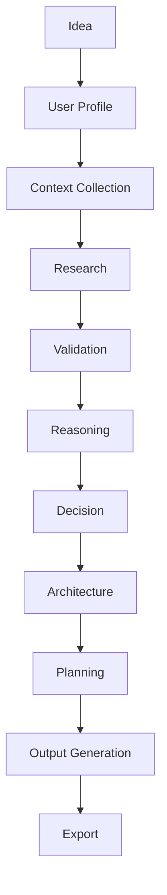
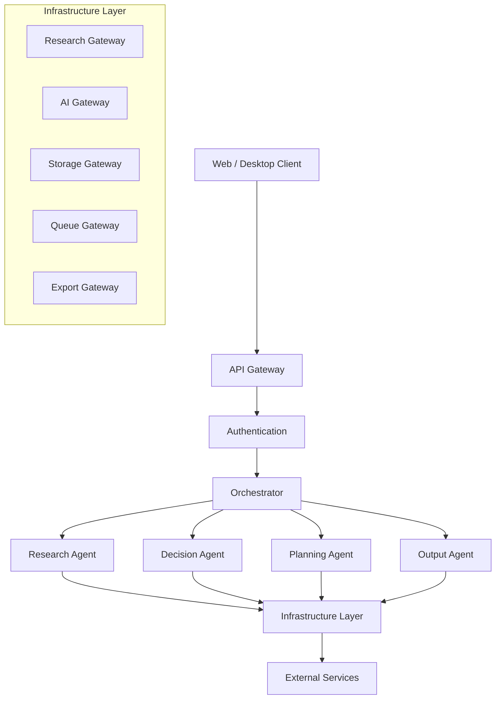

# Genesis Engine - System Architecture

Version: 0.1  
Status: Draft  
Priority: Critical  
Depends On:
- 00_project_rules.md

---

## Purpose

This document defines the complete high-level architecture of Genesis.

It explains how every major system works together before implementation begins.

This document is intentionally technology-aware but implementation-independent. Lower-level documents (backend, database, agents, frontend, deployment) will implement the architecture defined here.

If any future implementation conflicts with this document, this document has higher priority unless an approved architectural decision replaces it.

---

## What is Genesis?

Genesis is an AI-native Product Intelligence Platform.

It is **not** an AI coding assistant.

It is **not** another PRD generator.

It is **not** another chatbot.

Genesis is an intelligent engineering system that helps users transform uncertain ideas into validated, production-ready execution blueprints.

Instead of asking:

> "How do I build this?"

Genesis first asks:

> "Should this even be built?"

Only after sufficient validation does Genesis generate implementation plans.

---

## Primary Objective

Genesis exists to reduce expensive engineering mistakes before they happen.

Every workflow inside Genesis should increase one or more of these:

- Engineering quality
- Product quality
- Decision quality
- Security
- AI execution quality
- Development speed
- Cost efficiency
- Long-term maintainability

---

## System Philosophy

Genesis never assumes the user is correct.

Genesis challenges assumptions.

Genesis validates evidence.

Genesis reasons over evidence.

Genesis recommends trade-offs.

Genesis generates execution plans.

Genesis measures confidence.

Genesis explains uncertainty.

---

## Core Workflow

Every project follows the same lifecycle.

Some workflows may skip unnecessary stages, but the overall order never changes.

---

## System Boundaries

Genesis focuses only on product intelligence.

Everything outside this scope should integrate with external tools rather than being rebuilt.

### Genesis WILL

✓ Research markets  
✓ Validate ideas  
✓ Compare competitors  
✓ Analyze technologies  
✓ Recommend architecture  
✓ Recommend AI workflows  
✓ Generate engineering documentation  
✓ Generate AI-ready project files  
✓ Generate prompts  
✓ Generate security recommendations  
✓ Produce implementation blueprints  
✓ Track project evolution  

---

### Genesis WILL NOT

✗ Become an IDE  
✗ Become GitHub  
✗ Replace Cursor  
✗ Replace Z.ai  
✗ Replace Codex  
✗ Replace Figma  
✗ Replace Jira  
✗ Replace CI/CD  
✗ Replace cloud providers  
✗ Replace software engineers  

Genesis integrates with these systems instead of replacing them.

---

## Core Design Principles

### Principle 1: Reason Before Generation

Generation without reasoning creates technical debt.

---

### Principle 2: Evidence Before Reasoning

Reasoning should be supported by collected evidence whenever possible.

---

### Principle 3: One Responsibility Per Component

Components communicate.

Components do not absorb responsibilities from each other.

---

### Principle 4: Replace Providers, Never Replace Architecture

Providers change. Architecture remains stable.

---

### Principle 5: LLMs Reason, Software Executes

Clear separation between reasoning and execution.

---

### Principle 6: Every Expensive Operation Must Be Measurable

Latency. Cost. Tokens. Failures. Cache hits.

Everything should be observable.

---

## High-Level Architecture

---

## Layered Architecture

Genesis consists of six logical layers.

### Layer 1: Presentation Layer

Responsible for:
- UI
- Voice
- Authentication
- User interaction
- Progress updates

This layer contains no business logic.

---

### Layer 2: Application Layer

Responsible for:
- Workflow execution
- Request routing
- User sessions
- Job orchestration

This layer coordinates work.

It does not perform research itself.

---

### Layer 3: Agent Layer

Responsible for intelligent reasoning.

Contains:
- Research Agent
- Decision Agent
- Planning Agent
- Output Agent

Each agent owns exactly one responsibility.

---

### Layer 4: Business Layer

Responsible for deterministic logic.

Examples:
- Cost calculations
- Project state
- Permission checks
- Subscription validation
- Artifact generation
- File packaging

These tasks should never require an LLM.

---

### Layer 5: Infrastructure Layer

Responsible for communication with external systems.

Examples:
- OpenRouter
- Gemini
- GitHub
- Search APIs
- Vector databases
- Object storage
- Payment provider
- Queue

Everything external enters Genesis here.

---

### Layer 6: External Systems

Everything Genesis does not control.

Examples:
- OpenRouter
- Gemini
- GitHub
- Exa
- Tavily
- Brave
- Stripe
- Cloudflare
- Supabase
- PostgreSQL
- Redis
- Future providers

---

## Core Components

### 1. API Gateway

Single entry point.

Responsibilities:
- Authentication
- Rate limiting
- Request validation
- Session creation
- Request routing

No business logic.

---

### 2. Orchestrator

The brain of workflow execution.

Responsibilities:
- Decide workflow
- Call agents
- Track progress
- Handle retries
- Resume failed workflows
- Coordinate asynchronous tasks

The Orchestrator never performs research.

It delegates.

---

### 3. Research Agent

Purpose: Collect evidence.

Responsibilities:
- Market research
- Competitor research
- Technology research
- Documentation research
- Pricing research
- Open-source research

Outputs: Evidence. Not conclusions.

---

### 4. Decision Agent

Purpose: Convert evidence into engineering decisions.

Examples:
- Should this product exist?
- Should this feature exist?
- Should the user build MVP?
- Should the stack change?

Outputs: Structured engineering decisions with confidence scores.

---

### 5. Planning Agent

Purpose: Convert decisions into implementation plans.

Outputs:
- PRD
- Architecture
- Database schema
- API contracts
- Roadmap
- Development phases
- AI execution plans

---

### 6. Output Agent

Purpose: Convert structured plans into exportable assets.

Examples:
- Markdown
- Mermaid diagrams
- Prompt files
- Rule files
- Configuration files
- Architecture documents
- ZIP packages
- Cursor-ready documentation

---

## Important Rule

**No agent communicates directly with external providers.**

Every external dependency must go through a Gateway.

This allows Genesis to replace providers without changing agent logic.

---

## End of Document
