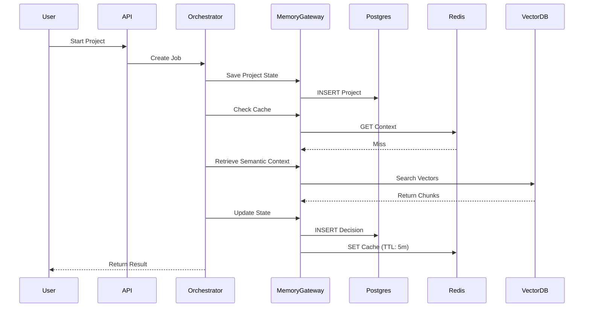

# 05_memory_architecture.md

Version: 1.0
Status: Approved
Priority: Critical
Depends On: 01_system_architecture.md

---

# Purpose

This document defines how Genesis manages state, context, and memory across its lifecycle.

Genesis is stateless at the API layer but stateful at the domain layer.

Memory is categorized into four distinct types:
1. **Transient Memory** (Request Scope)
2. **Persistent Memory** (Project Scope)
3. **Semantic Memory** (Vector/Knowledge Scope)
4. **System Memory** (Cache/Observability Scope)

---

# Design Principles

## Principle 1: Separation of Concerns
Memory access is never direct. All memory operations go through the **Infrastructure Layer** via **Gateway Interfaces**.

## Principle 2: Immutability
Once a decision, research result, or plan is saved, it is immutable. Updates create new versions (Event Sourcing pattern).

## Principle 3: Context Isolation
Every user session and project has a strictly isolated memory space. Cross-contamination is impossible.

## Principle 4: Cost-Efficiency
Expensive memory (Vector DB, LLM Context) is used sparingly. Cheap memory (Redis, Disk) is used for hot data.

## Principle 5: Lazy Loading
Data is loaded only when required by the **Targeted Context Strategy (TCS)**.

---

# Memory Layers

## 1. Transient Memory (Request Scope)

**Lifetime:** Duration of a single API request/workflow execution.
**Storage:** RAM / In-Memory Objects.
**Purpose:** Hold correlation IDs, current user context, temporary calculation results.

**Implementation:**
- `CorrelationId` passed through all layers.
- `ExecutionContext` object containing user ID, project ID, current phase.
- Cleaned up immediately after response.

**Rules:**
- Never persist transient data to disk.
- Never expose transient IDs to the client unless necessary.

---

## 2. Persistent Memory (Project Scope)

**Lifetime:** Lifetime of the project (indefinite).
**Storage:** PostgreSQL (Relational Data).
**Purpose:** Store projects, ideas, research reports, decisions, plans, artifacts.

**Schema Strategy:**
- **Projects Table:** `id`, `user_id`, `name`, `status`, `created_at`, `updated_at`
- **Ideas Table:** `id`, `project_id`, `content`, `validation_status`
- **ResearchReports Table:** `id`, `project_id`, `evidence_json`, `sources`, `timestamp`
- **Decisions Table:** `id`, `project_id`, `decision_type`, `confidence_score`, `reasoning`
- **Plans Table:** `id`, `project_id`, `plan_version`, `artifacts_json`
- **Artifacts Table:** `id`, `project_id`, `file_path`, `content_hash`, `version`

**Rules:**
- All writes are transactional.
- Soft deletes only (never hard delete user data).
- Every change generates a **Domain Event**.

---

## 3. Semantic Memory (Knowledge Scope)

**Lifetime:** Long-term (until explicitly purged).
**Storage:** Vector Database (e.g., pgvector, Pinecone, Weaviate).
**Purpose:** Enable RAG (Retrieval-Augmented Generation) for agents.

**What is Embedded:**
- User's past successful projects (patterns).
- Industry standards and best practices (pre-loaded).
- Project-specific context (for deep reasoning).

**Embedding Strategy:**
- **Chunk Size:** 512 tokens (optimal for retrieval).
- **Overlap:** 50 tokens (to maintain context continuity).
- **Metadata:** Each vector stores `project_id`, `doc_type`, `timestamp`, `relevance_score`.

**Retrieval Logic:**
1. Agent asks a question.
2. **Memory Gateway** converts question to embedding.
3. Query Vector DB for top-K similar chunks filtered by `project_id`.
4. Inject retrieved chunks into LLM context.

**Rules:**
- Never store PII (Personally Identifiable Information) in vectors.
- Vectors are updated asynchronously (not in the critical path).

---

## 4. System Memory (Cache Scope)

**Lifetime:** Short-term (TTL based).
**Storage:** Redis.
**Purpose:** Reduce latency and cost.

**Cache Strategies:**

### A. API Response Cache
- **Key:** `api:{user_id}:{endpoint}:{params_hash}`
- **TTL:** 5 minutes.
- **Use Case:** Repeated identical requests.

### B. LLM Completion Cache
- **Key:** `llm:{provider}:{model}:{prompt_hash}`
- **TTL:** 7 days (or indefinite for deterministic prompts).
- **Use Case:** Avoid paying for repeated identical generations.

### C. Workflow State Cache
- **Key:** `workflow:{job_id}`
- **TTL:** 24 hours.
- **Use Case:** Track progress of long-running async jobs.

### D. Rate Limit Counters
- **Key:** `rate:{user_id}:{window}`
- **TTL:** Rolling window.
- **Use Case:** Enforce quotas.

**Rules:**
- Cache is ephemeral. If cache misses, fallback to DB/Provider.
- Cache invalidation happens on write operations.

---

# Memory Gateway Interface

All memory operations must use the `IMemoryGateway` interface.

```typescript
interface IMemoryGateway {
  // Persistent
  saveProject(project: Project): Promise<void>;
  getProject(id: string): Promise<Project>;
  saveArtifact(artifact: Artifact): Promise<void>;
  
  // Semantic
  embedAndStore(text: string, metadata: Metadata): Promise<string>;
  retrieveContext(query: string, filters: Filter): Promise<ContextChunk[]>;
  
  // Cache
  setCache(key: string, value: any, ttl: number): Promise<void>;
  getCache(key: string): Promise<any | null>;
  invalidateCache(pattern: string): Promise<void>;
}
```

**Implementation Note:**
The application layer depends ONLY on this interface. The actual implementation (Postgres, Redis, PGVector) is injected at runtime.

---

# Data Lifecycle Flow



---

# Security & Privacy

1. **Encryption at Rest:** All database volumes encrypted (AES-256).
2. **Encryption in Transit:** TLS 1.3 for all internal communication.
3. **Tenant Isolation:** `user_id` and `project_id` are mandatory filters in ALL queries. Row Level Security (RLS) enabled in PostgreSQL.
4. **Data Retention:** Users can request full data export or deletion. Deletion cascades to Vector DB and Cache.

---

# Failure Scenarios

| Scenario | Impact | Mitigation |
| :--- | :--- | :--- |
| **Redis Down** | Higher latency, increased LLM costs | Fallback to direct DB/LLM calls. System continues. |
| **Postgres Down** | Critical Failure | Circuit breaker opens. Queue jobs for retry. Alert Ops. |
| **Vector DB Slow** | Slower agent reasoning | Timeout after 2s. Fallback to keyword search or empty context. |
| **Cache Corruption** | Stale data | TTL ensures auto-expiry. Manual flush available via admin command. |

---

# Observability

Every memory operation emits metrics:
- `memory.read.latency`
- `memory.write.latency`
- `cache.hit_ratio`
- `vector.search.duration`
- `db.connection.pool.usage`

Logs include `correlation_id` to trace a request across all memory layers.

---

# End of Document
