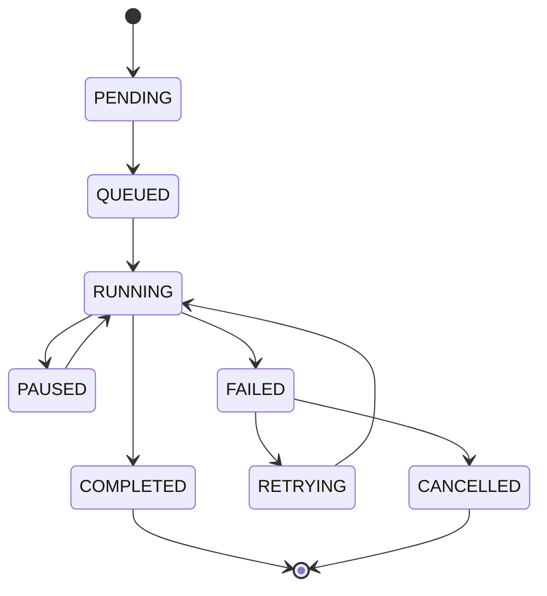
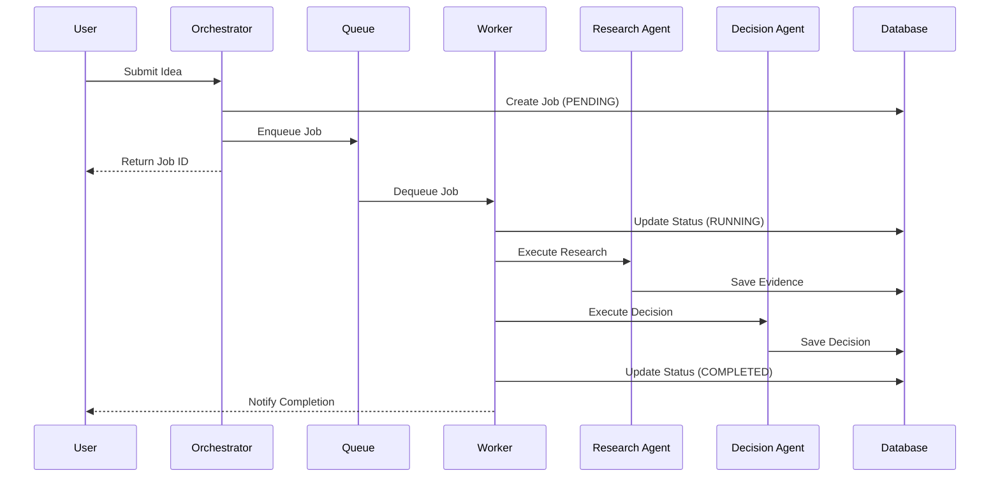

# 06_execution_model.md

Version: 1.0
Status: Approved
Priority: Critical
Depends On: 01_system_architecture.md, 05_memory_architecture.md

---

# Purpose

This document defines how Genesis executes workflows from start to finish.

It describes the **Execution Model** which ensures reliability, observability, and cost-efficiency.

Genesis uses an **Asynchronous Event-Driven Architecture** with **Synchronous API Facade**.

---

# Core Execution Philosophy

## 1. Fire-and-Forget is Forbidden
Every operation is tracked. No task is ever lost.

## 2. Idempotency
Retrying the same request produces the same result without side effects.

## 3. Granular State
Every step in a workflow has a defined state. Partial failures are recoverable.

## 4. Human-in-the-Loop
Critical decisions pause execution for user approval.

---

# Execution States

Every job transitions through these states:



### State Definitions

| State | Description | Action |
| :--- | :--- | :--- |
| **PENDING** | Request received, validation in progress | Validate input, reserve resources |
| **QUEUED** | Validation passed, waiting for worker | Push to job queue |
| **RUNNING** | Agent actively processing | Execute logic, update progress |
| **PAUSED** | Waiting for user input/approval | Notify user, wait for webhook/callback |
| **COMPLETED** | Success | Store artifacts, notify user |
| **FAILED** | Unrecoverable error | Log error, trigger alert, offer retry |
| **RETRYING** | Automatic retry scheduled | Backoff delay, re-queue |
| **CANCELLED** | User or system aborted | Cleanup resources, archive logs |

---

# Workflow Engine Architecture

The Workflow Engine consists of three components:

## 1. Orchestrator (Coordinator)
- Receives API requests.
- Validates input.
- Creates a `JobEntity`.
- Pushes job to the **Queue Gateway**.
- Does NOT execute logic itself.

## 2. Worker (Executor)
- Polls the queue for jobs.
- Loads the job context.
- Executes the specific **Agent** or **Capability**.
- Updates job state in real-time.
- Handles retries and errors.

## 3. Scheduler (Timekeeper)
- Manages delayed jobs (e.g., retries with backoff).
- Handles timeouts (kills stuck jobs).
- Triggers periodic maintenance tasks.

---

# Execution Flow: Step-by-Step

### Step 1: Request Ingestion
```
POST /api/v1/projects/{id}/validate
Header: { Authorization, X-Correlation-ID }
Body: { idea_description, constraints }
```
- API Gateway validates auth & rate limits.
- Generates `correlation_id` if missing.
- Passes to Orchestrator.

### Step 2: Job Creation
- Orchestrator creates `Job` record in Postgres with status `PENDING`.
- Runs schema validation.
- Transitions status to `QUEUED`.

### Step 3: Queue Dispatch
- Orchestrator calls `QueueGateway.push(job)`.
- Message format:
  ```json
  {
    "jobId": "uuid",
    "type": "VALIDATION_WORKFLOW",
    "payload": { ... },
    "priority": 5,
    "maxRetries": 3
  }
  ```

### Step 4: Worker Execution
- Worker picks up job.
- Status -> `RUNNING`.
- Loads **Targeted Context** (TCS).
- Invokes **Decision Agent**.
- Streams progress updates to Redis Pub/Sub (for real-time UI).

### Step 5: Agent Processing
- Agent calls external providers via **Gateways**.
- Results stored in **Persistent Memory**.
- If human approval needed -> Status -> `PAUSED`.

### Step 6: Completion
- All steps finished.
- Artifacts generated.
- Status -> `COMPLETED`.
- Cache invalidated.
- Webhook sent to user (if configured).

---

# Retry Strategy

Genesis uses **Exponential Backoff with Jitter**.

| Attempt | Delay | Jitter |
| :--- | :--- | :--- |
| 1 | 0s | - |
| 2 | 5s | ±2s |
| 3 | 30s | ±10s |
| 4 | 2m | ±30s |
| 5 | 10m | ±2m |

**Max Retries:** 5 attempts.
**Dead Letter Queue:** Jobs failing after 5 attempts move to DLQ for manual inspection.

**Retryable Errors:**
- Network timeouts.
- 429 Rate Limits.
- 503 Service Unavailable.

**Non-Retryable Errors:**
- 400 Bad Request.
- 401 Unauthorized.
- 402 Payment Required.
- Logic errors (deterministic failures).

---

# Rollback Mechanism

If a workflow fails mid-way:

1. **Compensating Transactions:**
   - If Research succeeded but Planning failed -> Delete partial research data (or mark as orphaned).
   - If Payment succeeded but Job failed -> Refund or credit user account.

2. **Snapshot Restore:**
   - Before major state changes, a snapshot of the project state is saved.
   - On critical failure, revert to last stable snapshot.

3. **Manual Intervention:**
   - Ops team can manually replay or cancel jobs via Admin Dashboard.

---

# Concurrency Control

To prevent race conditions:

- **Optimistic Locking:** Version numbers on database rows. Update fails if version mismatch.
- **Distributed Locks:** Redis RedLock for critical sections (e.g., billing updates).
- **Queue Isolation:** Separate queues for different priorities (High, Normal, Low).

---

# Observability Hooks

Every state transition emits an event:

```typescript
interface JobEvent {
  jobId: string;
  previousState: string;
  newState: string;
  timestamp: Date;
  correlationId: string;
  metadata: {
    durationMs: number;
    costUsd: number;
    tokensUsed: number;
    errorMessage?: string;
  };
}
```

These events are pushed to:
- **Logging System** (ELK/Datadog).
- **Metrics System** (Prometheus).
- **Audit Log** (Immutable storage for compliance).

---

# Cost Control During Execution

1. **Token Budgeting:**
   - Each job has a `max_token_budget`.
   - Agents check remaining budget before every LLM call.
   - If exceeded -> Fail gracefully with "Budget Exceeded" error.

2. **Timeout Enforcement:**
   - Hard timeout per job (e.g., 15 mins).
   - Soft timeout per agent step (e.g., 2 mins).

3. **Circuit Breakers:**
   - If a provider (e.g., OpenRouter) fails > 5 times in 1 minute -> Open circuit.
   - Switch to fallback provider or reject new jobs temporarily.

---

# Example: Validation Workflow



---

# End of Document
