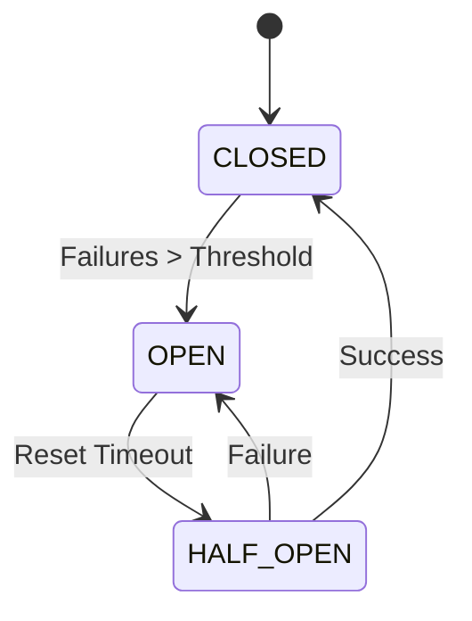

# 07_gateway_architecture.md

Version: 1.0
Status: Approved
Priority: Critical
Depends On: 01_system_architecture.md

---

# Purpose

This document defines the **Gateway Pattern** implementation for Genesis.

Gateways are the **ONLY** way Genesis communicates with external systems.

This ensures:
- **Provider Agnosticism:** Swap OpenRouter for Anthropic without changing Agent code.
- **Testability:** Mock gateways for unit tests.
- **Observability:** Centralized logging, metrics, and error handling.
- **Resilience:** Circuit breakers, retries, and timeouts implemented once.

---

# Gateway Principles

## 1. Single Responsibility
Each gateway handles ONE type of external dependency.

## 2. Interface Segregation
Agents depend on small, specific interfaces, not monolithic gateways.

## 3. Failure Translation
External errors (HTTP 500, Timeout) are translated into internal `DomainError` objects.

## 4. No Business Logic
Gateways transport data. They do not interpret it.

---

# Gateway Inventory

Genesis implements five core gateways:

| Gateway | Responsibility | Providers |
| :--- | :--- | :--- |
| **AIGateway** | LLM Inference | OpenRouter, Gemini, Anthropic, Ollama |
| **ResearchGateway** | Web Search & Data | Exa, Tavily, Brave, Serper |
| **StorageGateway** | Persistence | PostgreSQL, Supabase, S3, LocalFS |
| **QueueGateway** | Job Messaging | Redis Streams, BullMQ, SQS |
| **ExportGateway** | File Generation | ZIP, Markdown, PDF, Git |

---

# Interface Definitions

## 1. AIGateway

```typescript
interface AIGateway {
  // Core Inference
  generateCompletion(request: CompletionRequest): Promise<CompletionResponse>;
  
  // Streaming
  streamCompletion(request: CompletionRequest): AsyncIterable<StreamChunk>;
  
  // Embeddings
  generateEmbedding(text: string): Promise<number[]>;
  
  // Health
  getHealthStatus(): ProviderHealth;
}

interface CompletionRequest {
  model: string;
  messages: Message[];
  temperature?: number;
  maxTokens?: number;
  stopSequences?: string[];
  correlationId: string;
}

interface CompletionResponse {
  content: string;
  usage: TokenUsage;
  provider: string;
  latencyMs: number;
}
```

**Implementation Strategy:**
- Factory pattern selects provider based on config or user preference.
- Fallback chain: If OpenRouter fails -> Try Gemini -> Try Anthropic.

---

## 2. ResearchGateway

```typescript
interface ResearchGateway {
  searchWeb(query: string, options: SearchOptions): Promise<SearchResult[]>;
  fetchUrlContent(url: string): Promise<string>;
  getNews(topic: string): Promise<NewsItem[]>;
  getAcademicPapers(keywords: string[]): Promise<Paper[]>;
}

interface SearchResult {
  title: string;
  url: string;
  snippet: string;
  publishedDate?: Date;
  relevanceScore: number;
  source: 'exa' | 'tavily' | 'brave';
}
```

**Implementation Strategy:**
- Aggregate results from multiple providers.
- Deduplicate by URL.
- Re-rank by relevance.

---

## 3. StorageGateway

```typescript
interface StorageGateway {
  // Relational
  query<T>(sql: string, params: any[]): Promise<T[]>;
  transaction<T>(callback: () => Promise<T>): Promise<T>;
  
  // Key-Value (Cache)
  get(key: string): Promise<any>;
  set(key: string, value: any, ttl?: number): Promise<void>;
  delete(key: string): Promise<void>;
  
  // Vector
  storeVector(embedding: number[], metadata: Metadata): Promise<string>;
  searchVector(query: number[], limit: number): Promise<VectorResult[]>;
  
  // Blob
  uploadFile(path: string, content: Buffer): Promise<string>;
  downloadFile(path: string): Promise<Buffer>;
}
```

**Implementation Strategy:**
- Abstracts SQL dialect differences.
- Handles connection pooling internally.

---

## 4. QueueGateway

```typescript
interface QueueGateway {
  push(job: JobMessage): Promise<void>;
  pop(queueName: string): Promise<JobMessage | null>;
  acknowledge(jobId: string): Promise<void>;
  nack(jobId: string, requeue: boolean): Promise<void>;
  schedule(job: JobMessage, delayMs: number): Promise<void>;
  getQueueStats(queueName: string): Promise<QueueStats>;
}
```

**Implementation Strategy:**
- Supports priority queues.
- Guarantees at-least-once delivery.

---

## 5. ExportGateway

```typescript
interface ExportGateway {
  generateMarkdown(content: MarkdownNode): string;
  generateMermaidDiagram(graph: MermaidGraph): string;
  createZipPackage(files: FileEntry[]): Promise<Buffer>;
  pushToGit(repoUrl: string, files: FileEntry[], commitMsg: string): Promise<string>;
  exportToNotion(pageId: string, content: any): Promise<string>;
}
```

**Implementation Strategy:**
- Purely functional transformations where possible.
- Git operations use isolated temporary directories.

---

# Error Handling Strategy

All gateways throw standardized `GatewayError` types:

```typescript
enum GatewayErrorCode {
  CONNECTION_FAILED = 'CONNECTION_FAILED',
  TIMEOUT = 'TIMEOUT',
  RATE_LIMITED = 'RATE_LIMITED',
  AUTH_FAILED = 'AUTH_FAILED',
  NOT_FOUND = 'NOT_FOUND',
  INVALID_RESPONSE = 'INVALID_RESPONSE',
  QUOTA_EXCEEDED = 'QUOTA_EXCEEDED'
}

class GatewayError extends Error {
  constructor(
    public code: GatewayErrorCode,
    public provider: string,
    public originalError?: any,
    public retryable: boolean
  ) {
    super(`${provider}: ${code}`);
  }
}
```

**Handling Logic:**
- `retryable: true` -> Trigger retry logic in Orchestrator.
- `retryable: false` -> Fail immediately, notify user.

---

# Circuit Breaker Implementation

Each gateway instance has an embedded Circuit Breaker.

**States:**
1. **CLOSED:** Normal operation. Requests pass through.
2. **OPEN:** Failure threshold exceeded. Requests fail immediately.
3. **HALF-OPEN:** Testing recovery. Allow one request through.

**Configuration:**
- `failureThreshold`: 5 failures in 60 seconds.
- `resetTimeout`: 30 seconds.
- `monitoringWindow`: 60 seconds.



---

# Observability & Metrics

Every gateway call emits:

1. **Metrics:**
   - `gateway.calls.total{provider, operation, status}`
   - `gateway.latency.histogram{provider, operation}`
   - `gateway.tokens.used{provider}`
   - `gateway.cost.usd{provider}`

2. **Logs:**
   - Structured JSON logs with `correlation_id`.
   - Request/Response payloads (sanitized, no PII).
   - Error stack traces.

3. **Traces:**
   - Distributed tracing spans (OpenTelemetry).
   - Links to upstream/downstream services.

---

# Security Considerations

1. **Credential Management:**
   - API keys stored in environment variables or secret manager (AWS Secrets Manager / Vault).
   - Never logged or passed in URLs.

2. **Input Sanitization:**
   - All outbound payloads validated against schemas.
   - Prevent injection attacks in SQL/Search queries.

3. **Rate Limiting:**
   - Client-side rate limiting to respect provider quotas.
   - Token bucket algorithm per API key.

4. **Data Minimization:**
   - Only send necessary data to external providers.
   - Strip internal IDs and metadata before transmission.

---

# Testing Strategy

## Unit Tests
- Mock external HTTP calls using `nock` or similar.
- Verify error translation logic.
- Test circuit breaker state transitions.

## Integration Tests
- Spin up local Docker containers for Postgres/Redis.
- Use sandbox environments for paid APIs (Exa, Tavily).
- Verify end-to-end data flow.

## Chaos Tests
- Randomly inject latency and failures.
- Verify system resilience and fallback behavior.

---

# Example Usage

```typescript
// Injected into Agent Constructor
class DecisionAgent {
  constructor(
    private aiGateway: AIGateway,
    private storageGateway: StorageGateway
  ) {}

  async makeDecision(projectId: string): Promise<Decision> {
    // 1. Fetch Context via Gateway
    const context = await this.storageGateway.query(
      'SELECT * FROM research WHERE project_id = $1',
      [projectId]
    );

    // 2. Generate Reasoning via Gateway
    const response = await this.aiGateway.generateCompletion({
      model: 'anthropic/claude-3-sonnet',
      messages: [
        { role: 'user', content: `Analyze this evidence: ${JSON.stringify(context)}` }
      ],
      correlationId: crypto.randomUUID()
    });

    // 3. Save Result via Gateway
    await this.storageGateway.transaction(async () => {
      await this.storageGateway.query(
        'INSERT INTO decisions (...) VALUES (...)',
        [response.content]
      );
    });

    return parseDecision(response.content);
  }
}
```

---

# End of Document
