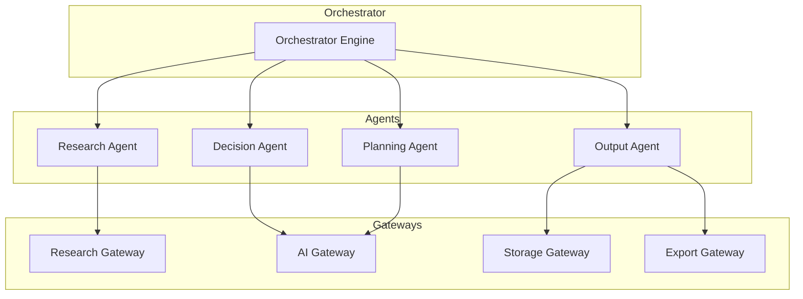
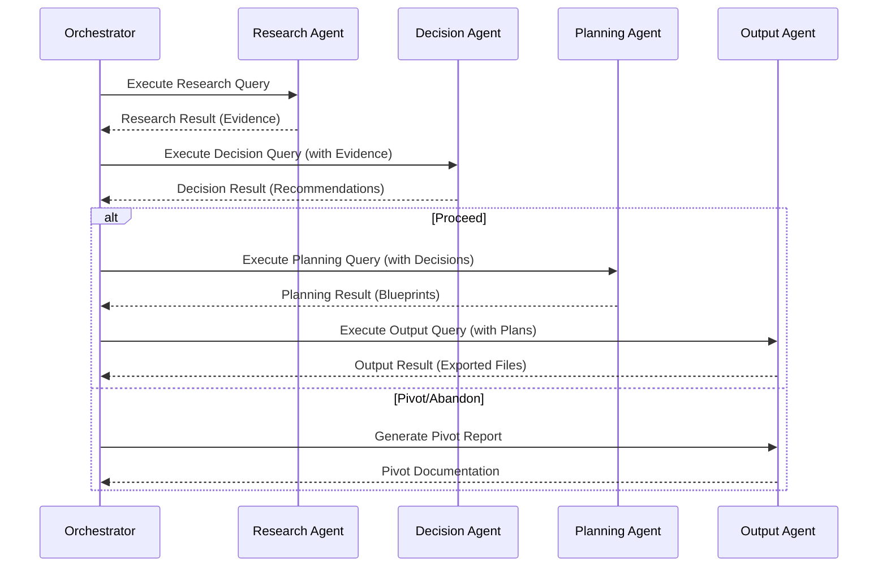

# Agent Specifications

Version: 1.0  
Status: Implemented  
Priority: Critical  

---

## Overview

This document specifies the four core AI agents that form the "brain" of Genesis Engine.

Each agent follows the **Single Responsibility Principle** and communicates only through defined interfaces.

---

## Agent Architecture



---

## 1. Research Agent

### Purpose
Collect evidence from multiple sources. Does NOT make conclusions.

### Responsibilities
- Market analysis research
- Competitor identification and analysis
- Technology stack research
- Pricing research
- Documentation research
- Open-source landscape research

### Interface
```typescript
interface IResearchAgent {
  execute(query: ResearchQuery): AsyncResult<ResearchResult>;
}
```

### Input: ResearchQuery
- `correlationId`: Request tracking
- `projectId`: Target project
- `researchTypes`: Array of research types needed
- `questions`: Specific questions to answer
- `constraints`: Budget, time, reliability limits

### Output: ResearchResult
- `evidence`: Array of Evidence objects
- `totalCost`: Cost of research operations
- `executionTime`: Time taken
- `gaps`: What couldn't be researched

### Evidence Structure
```typescript
interface Evidence {
  id: string;
  type: ResearchType;
  source: string;
  content: string;
  reliability: number; // 0.0 to 1.0
  timestamp: Date;
  metadata: Record<string, unknown>;
}
```

### Implementation Location
`src/agents/research-agent.ts` (110 lines)

### Gateway Dependency
`src/adapters/research-gateway.memory.ts` (in-memory for dev/testing)

---

## 2. Decision Agent

### Purpose
Convert evidence into engineering decisions with confidence scores.

### Responsibilities
- Product viability assessment
- Feature priority decisions
- Tech stack recommendations
- MVP scope definition
- Go-to-market strategy
- Risk assessment (security, compliance)

### Interface
```typescript
interface IDecisionAgent {
  execute(query: DecisionQuery): AsyncResult<DecisionResult>;
}
```

### Input: DecisionQuery
- `correlationId`: Request tracking
- `projectId`: Target project
- `evidence`: From Research Agent
- `decisionTypes`: Types of decisions needed
- `userConstraints`: User-provided constraints

### Output: DecisionResult
- `decisions`: Array of EngineeringDecision objects
- `overallConfidence`: Aggregated confidence score
- `recommendationAction`: PROCEED | PIVOT | ABANDON
- `risks`: Identified risks
- `assumptions`: Made assumptions

### Decision Structure
```typescript
interface EngineeringDecision {
  id: string;
  type: DecisionType;
  recommendation: RecommendationAction;
  confidence: ConfidenceScore; // 0.0 to 1.0
  rationale: string;
  tradeOffs: TradeOff[];
  assumptions: Assumption[];
  risks: Risk[];
}
```

### Decision Logic
1. Analyze all evidence
2. Calculate confidence per decision
3. Identify trade-offs
4. Surface assumptions
5. Quantify risks
6. Generate recommendation

### Implementation Location
`src/agents/decision-agent.ts` (277 lines)

### Gateway Dependency
`IAIGateway` for reasoning (via AI adapter)

---

## 3. Planning Agent

### Purpose
Convert approved decisions into actionable implementation plans.

### Responsibilities
- PRD generation
- Architecture design
- Database schema planning
- API contract definition
- Roadmap creation (phased)
- Development phase planning
- AI execution plan generation

### Interface
```typescript
interface IPlanningAgent {
  execute(query: PlanningQuery): AsyncResult<PlanningResult>;
}
```

### Input: PlanningQuery
- `correlationId`: Request tracking
- `projectId`: Target project
- `decisions`: From Decision Agent
- `planTypes`: Types of plans needed
- `constraints`: Time, budget, team size

### Output: PlanningResult
- `plans`: Array of Plan objects
- `roadmap`: Phased development timeline
- `architecture`: System architecture
- `databaseSchema`: DB design
- `apiContracts`: API specifications
- `estimatedCost`: Total estimated cost
- `timeline`: Development timeline

### Plan Structure
```typescript
interface Plan {
  id: string;
  type: PlanType;
  title: string;
  description: string;
  phases: Phase[];
  dependencies: string[];
  estimatedEffort: string;
  risks: Risk[];
}
```

### Implementation Location
`src/agents/planning-agent.ts` (648 lines)

### Gateway Dependency
`IAIGateway` for complex reasoning

---

## 4. Output Agent

### Purpose
Convert structured plans into exportable assets.

### Responsibilities
- Markdown documentation generation
- Mermaid diagram creation
- Prompt file generation
- Rule file creation (.clinerules)
- Configuration file generation
- ZIP package creation
- Cursor-ready documentation

### Interface
```typescript
interface IOutputAgent {
  execute(query: OutputQuery): AsyncResult<OutputResult>;
}
```

### Input: OutputQuery
- `correlationId`: Request tracking
- `projectId`: Target project
- `plans`: From Planning Agent
- `outputFormats`: Desired formats
- `destination`: Export location

### Output: OutputResult
- `artifacts`: Array of generated files
- `format`: Output format
- `size`: Total size in bytes
- `paths`: File paths
- `downloadUrl`: If applicable

### Supported Formats
- Markdown (.md)
- Mermaid diagrams (.mmd)
- JSON (.json)
- YAML (.yaml)
- ZIP archives (.zip)
- Prompt files (.txt)

### Implementation Location
`src/agents/output-agent.ts` (240 lines)

### Gateway Dependencies
- `IExportGateway` for file operations
- `IStorageGateway` for persistence

---

## Agent Communication Flow



---

## Error Handling

Each agent implements:
1. **Input Validation**: Validate queries before processing
2. **Timeout Protection**: Maximum execution time per agent
3. **Retry Logic**: Automatic retries for transient failures
4. **Circuit Breaker**: Prevent cascade failures
5. **Error Reporting**: Structured error responses

---

## Observability

Each agent emits:
- Start/End events
- Progress updates
- Cost tracking
- Token usage (for AI calls)
- Latency metrics
- Error rates

---

## Testing Strategy

### Unit Tests
- Test each agent in isolation
- Mock gateway dependencies
- Verify input/output contracts

### Integration Tests
- Test agent chains (Research → Decision → Planning)
- Test with real gateway adapters
- Verify state transitions

### E2E Tests
- Full workflow from idea to export
- Performance benchmarks
- Load testing

---

## Version History

| Version | Date | Changes |
|---------|------|---------|
| 1.0 | 2025-08-19 | Initial implementation complete |

---

## Related Documents

- `01_system_architecture.md` - Overall system design
- `08_contract_definitions.md` - Interface contracts
- `06_execution_model.md` - Workflow execution
- `10_coding_standards.md` - Implementation standards
