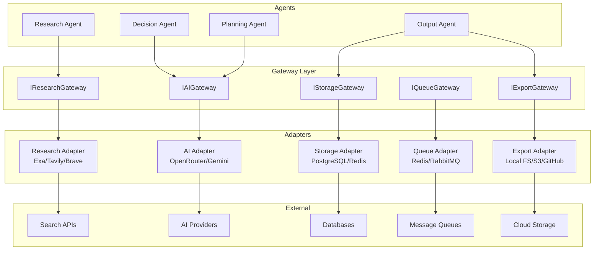
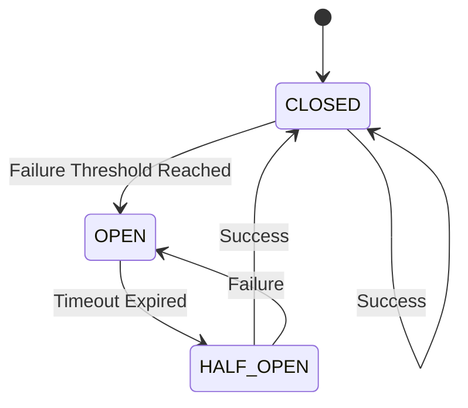
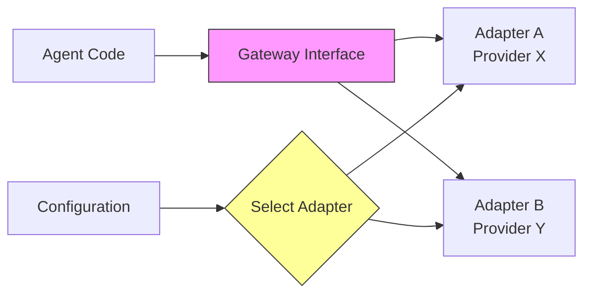

# Infrastructure Architecture

Version: 1.0  
Status: Implemented  
Priority: Critical  

---

## Overview

This document defines the Gateway infrastructure layer that abstracts all external system communications.

**Key Principle**: No agent communicates directly with external providers. Every external dependency must go through a Gateway.

---

## Gateway Architecture



---

## 1. AI Gateway

### Purpose
Abstract all AI provider communications (OpenRouter, Gemini, Anthropic, etc.)

### Interface
```typescript
interface IAIGateway {
  getCapabilities(provider: AIProvider, model: string): Promise<ModelCapabilities>;
  generate(request: AIRequest): AsyncResult<AIResponse>;
  stream(request: AIRequest): AsyncResult<AsyncIterable<AIResponse>>;
  listModels(provider: AIProvider): AsyncResult<string[]>;
  estimateCost(provider: AIProvider, model: string, tokens: number): Cost;
}
```

### Supported Providers
- OpenRouter (multi-model)
- Google Gemini
- Anthropic Claude
- OpenAI GPT
- Azure OpenAI
- Local LLM

### Features
- **Model Capabilities**: Context window, token limits, vision support
- **Cost Estimation**: Per-provider pricing calculation
- **Token Tracking**: Prompt/completion token counts
- **Latency Monitoring**: Response time tracking
- **Rate Limiting**: Provider-specific rate limit handling
- **Circuit Breaker**: Automatic fallback on failures

### Implementation Status
✅ Interface defined in `src/interfaces/gateway.interfaces.ts`  
🔄 Adapter implementation pending (Phase 5)

---

## 2. Research Gateway

### Purpose
Abstract all research/search provider communications (Exa, Tavily, Brave Search)

### Interface
```typescript
interface IResearchGateway {
  search(query: SearchQuery): AsyncResult<SearchResponse>;
  extractContent(url: string, correlationId: CorrelationId): AsyncResult<string>;
  convertEvidence(evidence: Evidence[], researchType: ResearchType): AsyncResult<Evidence[]>;
}
```

### Supported Providers
- Exa AI
- Tavily
- Brave Search
- Google Custom Search
- Bing Search API

### Features
- **Multi-Provider Search**: Web, news, academic, code
- **Content Extraction**: Full page content scraping
- **Evidence Conversion**: Structured evidence formatting
- **Date Filtering**: Time-range based searches
- **Domain Filtering**: Include/exclude specific domains
- **Relevance Scoring**: Result ranking

### Implementation Status
✅ Interface defined  
✅ In-memory adapter implemented (`src/adapters/research-gateway.memory.ts`)  
🔄 Production adapters pending (Phase 5)

---

## 3. Storage Gateway

### Purpose
Abstract all storage provider communications (PostgreSQL, Redis, S3, etc.)

### Interface
```typescript
interface IStorageGateway {
  execute<T>(query: StorageQuery<T>): AsyncResult<StorageResponse<T>>;
  connect(provider: StorageProvider): AsyncResult<void>;
  disconnect(provider: StorageProvider): AsyncResult<void>;
  healthCheck(provider: StorageProvider): AsyncResult<boolean>;
}
```

### Supported Providers
- PostgreSQL (primary database)
- Supabase (managed PostgreSQL)
- MongoDB (document store)
- Redis (caching/sessions)
- AWS S3 (object storage)
- Google Cloud Storage
- Local filesystem (dev)

### Operations
- READ: Fetch data by key/query
- WRITE: Insert new records
- UPDATE: Modify existing records
- DELETE: Remove records
- LIST: Query multiple records

### Features
- **ACID Transactions**: Multi-operation atomicity
- **Connection Pooling**: Efficient resource usage
- **Encryption**: At-rest encryption support
- **Compression**: Data compression options
- **TTL**: Time-to-live for cache entries
- **Consistency**: Eventual vs strong consistency

### Implementation Status
✅ Interface defined  
🔄 Adapters pending (Phase 5 - PostgreSQL priority)

---

## 4. Queue Gateway

### Purpose
Abstract all message queue communications (Redis, RabbitMQ, SQS, Kafka)

### Interface
```typescript
interface IQueueGateway {
  execute<T>(query: QueueQuery<T>): AsyncResult<QueueResponse<T>>;
  subscribe<T>(queueName: string, handler: (message: QueueMessage<T>) => Promise<void>): AsyncResult<void>;
  unsubscribe(queueName: string): AsyncResult<void>;
  getQueueLength(queueName: string): AsyncResult<number>;
  purge(queueName: string): AsyncResult<void>;
}
```

### Supported Providers
- Redis (dev/simple)
- RabbitMQ (production)
- AWS SQS
- Apache Kafka (high throughput)
- Local memory queue (testing)

### Operations
- ENQUEUE: Add message to queue
- DEQUEUE: Remove and process message
- PEEK: View without removing
- ACKNOWLEDGE: Confirm processing
- REJECT: Mark as failed
- RETRY: Re-queue failed message

### Features
- **Priority Queues**: High/medium/low priority
- **Delayed Messages**: Scheduled execution
- **Dead Letter Queue**: Failed message handling
- **Visibility Timeout**: Processing time limits
- **Max Retries**: Automatic retry limits
- **Pub/Sub**: Event broadcasting

### Implementation Status
✅ Interface defined  
🔄 Adapters pending (Phase 6)

---

## 5. Export Gateway

### Purpose
Abstract all export operations (local FS, S3, GitHub, ZIP generation)

### Interface
```typescript
interface IExportGateway {
  export(query: ExportQuery): AsyncResult<ExportResponse>;
  download(source: string, correlationId: CorrelationId): AsyncResult<Buffer>;
  delete(path: string, correlationId: CorrelationId): AsyncResult<void>;
  list(directory: string): AsyncResult<string[]>;
}
```

### Supported Providers
- Local filesystem (dev)
- AWS S3 (production)
- GitHub repositories
- GitHub Gists
- ZIP archive generation

### Export Formats
- Markdown files
- Mermaid diagrams
- JSON configurations
- YAML files
- ZIP archives
- Git repositories

### Features
- **Batch Export**: Multiple files in one operation
- **Compression**: ZIP/tar.gz support
- **Encryption**: Optional file encryption
- **Public Access**: Shareable links
- **Version Control**: Git integration
- **Overwrite Protection**: Prevent accidental overwrites

### Implementation Status
✅ Interface defined  
🔄 Adapters pending (Phase 5 - Local FS + ZIP first)

---

## Gateway Patterns

### Circuit Breaker Pattern



**Configuration:**
- `failureThreshold`: Number of failures before opening
- `successThreshold`: Successes needed to close
- `timeout`: Time before attempting recovery
- `monitoringPeriod`: Window for counting failures

### Retry Pattern

```typescript
interface RetryConfig {
  maxRetries: number;
  initialDelay: number; // ms
  maxDelay: number; // ms
  backoffMultiplier: number;
  retryableErrors: string[];
}
```

**Strategy:**
- Exponential backoff
- Jitter to prevent thundering herd
- Only retry transient errors
- Maximum delay cap

---

## Observability

### Metrics per Gateway

| Metric | Description |
|--------|-------------|
| `requestCount` | Total requests made |
| `successCount` | Successful requests |
| `failureCount` | Failed requests |
| `avgLatency` | Average response time |
| `p95Latency` | 95th percentile latency |
| `p99Latency` | 99th percentile latency |
| `totalCost` | Cumulative cost |
| `rateLimitHits` | Rate limit encounters |
| `circuitBreakerTrips` | Circuit breaker activations |

### Logging Structure

```json
{
  "timestamp": "2025-08-19T12:00:00Z",
  "correlationId": "corr_abc123",
  "gatewayType": "AI_GATEWAY",
  "provider": "OPENROUTER",
  "operation": "generate",
  "latency": 1250,
  "tokens": {
    "prompt": 450,
    "completion": 320,
    "total": 770
  },
  "cost": {
    "amount": 0.0023,
    "currency": "USD"
  },
  "success": true,
  "error": null
}
```

---

## Security

### Secrets Management
- Never hardcode API keys
- Use environment variables
- Encrypt secrets at rest
- Rotate keys regularly
- Audit secret access

### Input Validation
- Validate all input parameters
- Sanitize URLs and paths
- Enforce size limits
- Check content types

### Data Protection
- Encrypt sensitive data in transit
- Encrypt data at rest
- Mask logs (no secrets in logs)
- Implement access controls

---

## Provider Replacement Strategy



**Benefits:**
1. Change providers without touching agent code
2. A/B test different providers
3. Fallback to alternative providers
4. Cost optimization through provider switching

---

## Implementation Roadmap

### Phase 4 (Current)
✅ All gateway interfaces defined  
✅ In-memory Research Gateway implemented  
📝 Documentation complete

### Phase 5 (Next)
- [ ] AI Gateway: OpenRouter adapter
- [ ] Storage Gateway: PostgreSQL adapter
- [ ] Export Gateway: Local FS + ZIP adapter
- [ ] Configuration vault (Zod validation)
- [ ] Structured logging

### Phase 6
- [ ] Queue Gateway: Redis adapter
- [ ] Research Gateway: Exa/Tavily adapters
- [ ] Storage Gateway: Redis cache adapter
- [ ] Circuit breaker implementation
- [ ] Retry manager

### Phase 7
- [ ] Production deployments
- [ ] Monitoring dashboards
- [ ] Alert rules
- [ ] Runbooks for incidents

---

## Testing Strategy

### Unit Tests
- Mock external providers
- Test interface contracts
- Verify error handling

### Integration Tests
- Test with real providers (staging)
- Test circuit breaker behavior
- Test retry logic

### Chaos Engineering
- Simulate provider failures
- Test fallback mechanisms
- Verify graceful degradation

---

## Related Documents

- `01_system_architecture.md` - Overall architecture
- `08_contract_definitions.md` - Interface specifications
- `09_adr_template_and_governance.md` - Decision records
- `10_coding_standards.md` - Implementation standards

---

## Version History

| Version | Date | Changes |
|---------|------|---------|
| 1.0 | 2025-08-19 | Initial architecture defined |
