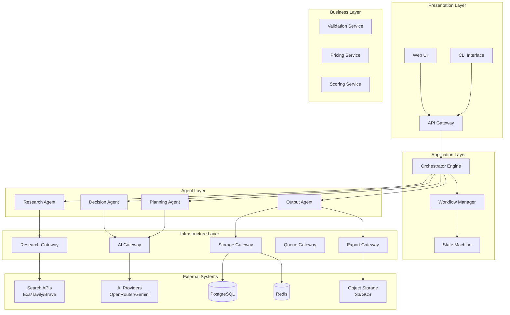
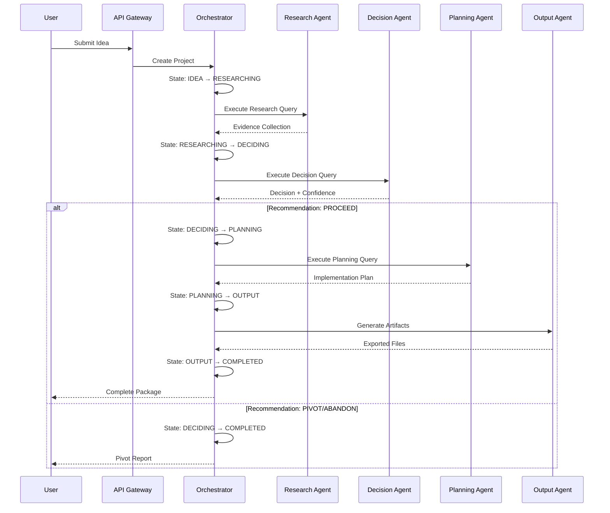
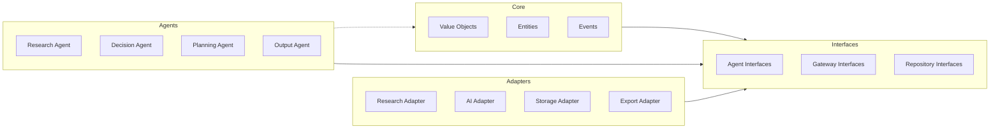
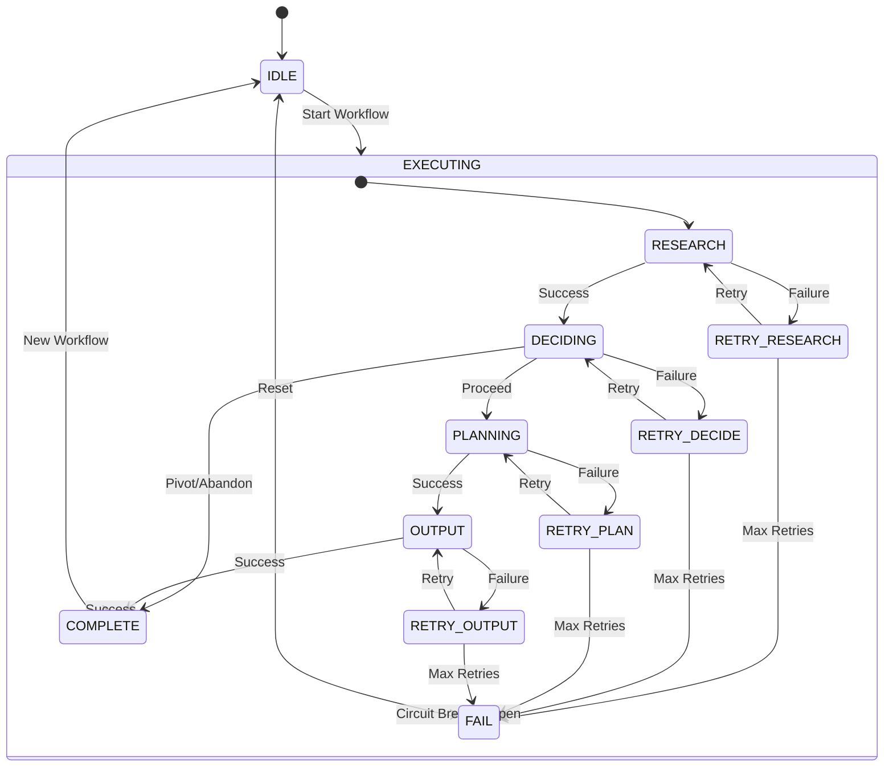
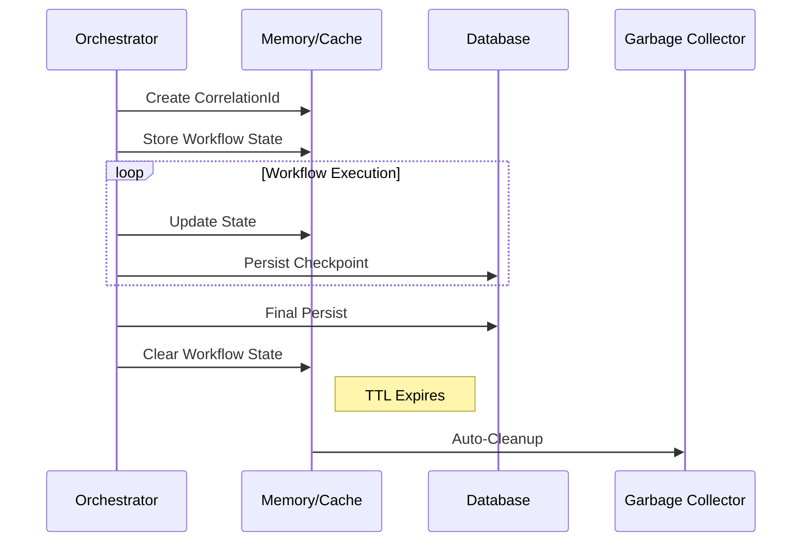
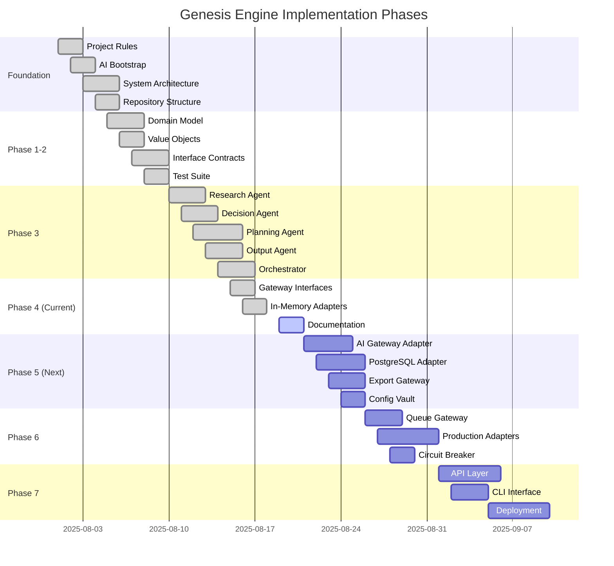
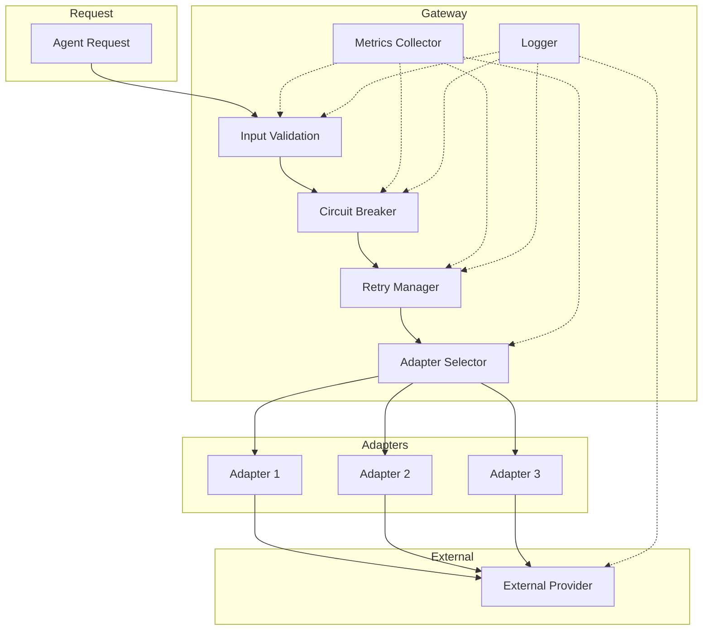
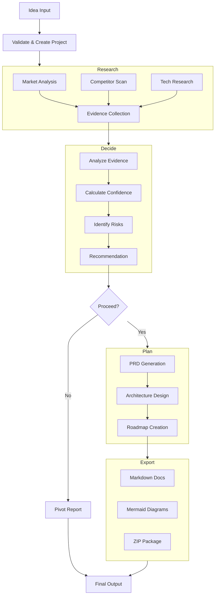

# System Diagrams

Version: 1.0  
Status: Complete  
Priority: High  

---

## 1. System Overview

---

## 2. Workflow Execution Flow

---

## 3. Architecture Dependencies

---

## 4. Retry & Rollback Flow

---

## 5. Memory Lifetime

---

## 6. Implementation Roadmap

---

## 7. Gateway Flow

---

## 8. Data Flow

---

## Related Documents

- `01_system_architecture.md` - Architecture overview
- `11_agent_specifications.md` - Agent details
- `12_gateway_implementation_guide.md` - Gateway guide

---

## Version History

| Version | Date | Changes |
|---------|------|---------|
| 1.0 | 2025-08-19 | Initial diagrams complete |
