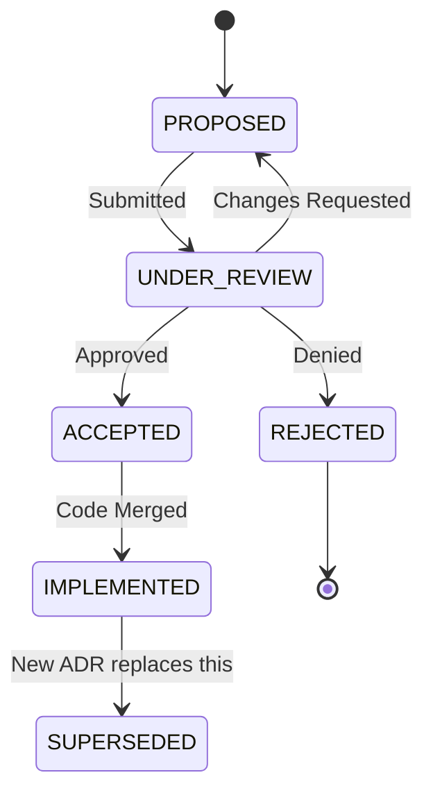

# 09_adr_template_and_governance.md

Version: 1.0
Status: Approved
Priority: Critical
Depends On: 01_system_architecture.md

---

# Purpose

This document defines the **Architecture Decision Record (ADR)** process and governance model for Genesis.

**Rule:** No significant architectural change is implemented without an ADR.

This ensures:
- Decisions are documented and traceable.
- Context and consequences are understood.
- Future maintainers know "why" not just "what".

---

# What Requires an ADR?

| Change Type | ADR Required? | Example |
| :--- | :--- | :--- |
| **New Core Component** | ✅ YES | Adding a new Agent type |
| **Technology Stack Change** | ✅ YES | Switching from Postgres to MongoDB |
| **API Contract Change** | ✅ YES | Breaking change in REST API |
| **Security Model Change** | ✅ YES | New authentication mechanism |
| **Performance Optimization** | ⚠️ MAYBE | If it adds complexity |
| **Bug Fix** | ❌ NO | Unless it reveals design flaw |
| **Refactoring** | ❌ NO | If behavior doesn't change |

---

# ADR Template

Every ADR follows this exact structure:

```markdown
# ADR-NNN: [Short Title]

## Status
[PROPOSED | ACCEPTED | REJECTED | SUPERSEDED]

## Date
YYYY-MM-DD

## Authors
- [Name/Role]

## Depends On
- ADR-NNN (if applicable)

---

# Context

What is the issue or decision that needs to be made?

Describe the forces at play:
- Technical constraints
- Business requirements
- Team capabilities
- Budget/Timeline

---

# Problem Statement

Clearly state the problem in one or two sentences.

Example:
> "The current monolithic agent design makes it impossible to scale research 
> operations independently from decision operations, leading to resource contention."

---

# Proposed Solution

Describe the proposed architecture or approach.

Include:
- Diagrams (Mermaid)
- Code snippets (if helpful)
- Data flow changes
- Interface changes

---

# Alternatives Considered

List at least 2 alternatives that were considered.

## Alternative 1: [Name]
**Description:** ...
**Pros:** ...
**Cons:** ...
**Why Rejected:** ...

## Alternative 2: [Name]
**Description:** ...
**Pros:** ...
**Cons:** ...
**Why Rejected:** ...

---

# Decision

State the final decision clearly.

> "We will implement [Solution] because [Reasons]."

---

# Consequences

What becomes easier or harder after this change?

## Positive Consequences
- ...
- ...

## Negative Consequences
- ...
- ...

## Risks
- Risk 1: [Description] -> Mitigation: [Action]
- Risk 2: [Description] -> Mitigation: [Action]

---

# Compliance

How will we verify this decision was implemented correctly?

- [ ] Code Review Checklist
- [ ] Integration Tests Added
- [ ] Documentation Updated
- [ ] Performance Benchmarks Run

---

# Notes

Any additional context, meeting notes, or references.

---

# Changelog

| Date | Change | Author |
| :--- | :--- | :--- |
| YYYY-MM-DD | Initial Draft | Name |
| YYYY-MM-DD | Updated based on review | Name |
```

---

# ADR Lifecycle



### States Explained

1. **PROPOSED:** Initial draft created by engineer/architect.
2. **UNDER_REVIEW:** Community/Core team reviewing. Comments added.
3. **ACCEPTED:** Approved. Ready for implementation.
4. **REJECTED:** Not approved. Reason documented.
5. **IMPLEMENTED:** Code merged and deployed.
6. **SUPERSEDED:** Replaced by a newer ADR.

---

# Governance Model

## Roles

### 1. Architect (You)
- Owns the overall vision.
- Final approval on all ADRs.
- Ensures alignment with Genesis philosophy.

### 2. Core Contributors
- Review ADRs.
- Provide technical feedback.
- Implement accepted ADRs.

### 3. Community Contributors
- Propose ADRs.
- Participate in discussions.
- Cannot approve ADRs.

## Approval Process

1. **Draft:** Author creates ADR in `docs/06_governance/adr/`.
2. **PR:** Submit Pull Request with ADR.
3. **Review Period:** Minimum 48 hours for comments.
4. **Decision:**
   - **Unanimous:** Architect + 2 Core Contributors approve -> Auto-merge.
   - **Disagreement:** Architect makes final call.
5. **Merge:** ADR number assigned (sequential).
6. **Implement:** Create follow-up PR for code changes referencing ADR-NNN.

---

# ADR Index

Maintain a living index file: `docs/06_governance/adr/README.md`

```markdown
# ADR Index

| Number | Title | Status | Date |
| :--- | :--- | :--- | :--- |
| ADR-001 | Initial Architecture | ACCEPTED | 2025-01-01 |
| ADR-002 | Gateway Pattern | ACCEPTED | 2025-01-02 |
| ADR-003 | [Current Proposal] | PROPOSED | 2025-01-15 |
```

---

# Example ADR

## ADR-001: Initial Architecture

**Status:** ACCEPTED  
**Date:** 2025-01-01  
**Authors:** Founder

### Context
Genesis needs a foundational architecture that supports AI-driven product validation while remaining flexible for future growth.

### Problem Statement
How do we design a system that separates reasoning (AI) from execution (code) while maintaining strict boundaries between components?

### Proposed Solution
Implement a layered architecture with:
- Presentation Layer
- Application Layer
- Agent Layer
- Business Layer
- Infrastructure Layer
- External Systems

Use Gateway pattern for all external dependencies.

### Alternatives Considered

**Alternative 1: Monolithic AI Agent**
- Single LLM handles everything.
- Pros: Simple to build initially.
- Cons: Impossible to debug, scale, or improve individual capabilities.
- Rejected due to lack of observability.

**Alternative 2: Microservices from Day 1**
- Separate services for each agent.
- Pros: Maximum scalability.
- Cons: Operational overhead too high for v1.
- Rejected due to complexity.

### Decision
We will implement a modular monolith with clear layer boundaries and Gateway abstractions. This allows future extraction to microservices if needed.

### Consequences

**Positive:**
- Easy to test individual layers.
- Clear separation of concerns.
- Provider swapping is trivial.

**Negative:**
- Deployment is single-unit (less flexible than microservices).

### Compliance
- [x] Architecture docs created
- [x] Gateway interfaces defined
- [ ] Implementation complete

---

# Enforcement

- CI pipeline checks that code changes reference an ADR if they touch core architecture files.
- Code reviews reject PRs that violate accepted ADRs without a superseding ADR.

---

# End of Document
